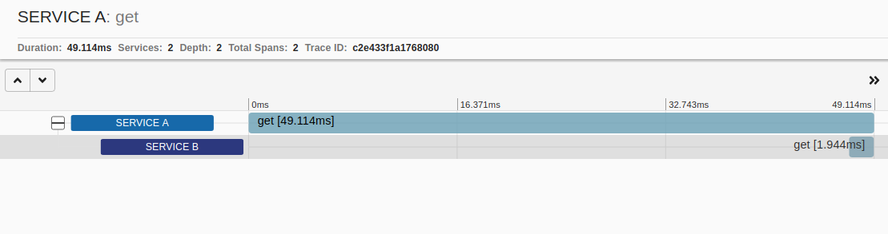
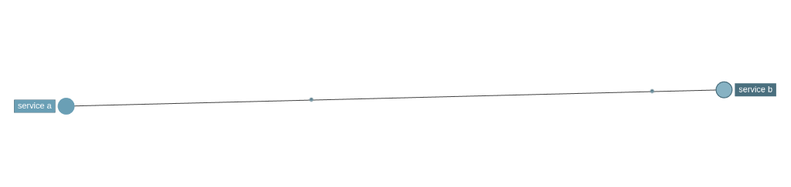

Nowadays, more and more projects are built using the service-oriented architecture (SOA) and more specifically using microservices: several services that have a single or a small set of responsibilities and "talk" to each other either over APIs or over messaging (e.g. via Kafka or some kind of queue system).

In this context, request tracing in applications (e.g. for debugging purposes) becomes harder than instrumenting a monolith, as each request to an application leads to communication with several other services. For this reason, there are specialized tools that have been developed in the last few years, called distributed tracing systems. The most popular distributed tracing tools are <a href="https://zipkin.io/" target="_blank" rel="nofollow noopener">Zipkin</a> and <a href="https://www.jaegertracing.io/" target="_blank" rel="noopener nofollow">Jaeger</a>.

In this post, We will see an example of the benefits and the value that distributed tracing can bring by using Zipkin. First, either download Zipkin or get the docker image from dockerhub. I'm using the docker image to start Zipkin:

```bash
docker run -d -p 9411:9411 openzipkin/zipkin
```

After that, you can access the Zipkin UI for browsing and querying traces. But what exactly is a trace? A **trace** describes and represents the whole request flow, through all the services within a distributed system. All parts of a trace share a common ID (the trace ID), which is used to find or filter a specific request. The other important concept is spans. A **span** is what we described as parts above, i.e. an activity that takes place in a specific service in the context of a request. So, a trace is composed of many spans.

Zipkin collects data from the services (we have to instrument our services to do so) and allows querying and filtering by various parameters and metadata. Identifiers (e.g. the trace ID) are sent in-band (for example via HTTP headers) from service to service, in order to let the receiver know there is a tracing in place, while the actual tracing details are sent to Zipkin out-of-band when a span is completed.

In order to see Zipkin in action, we will build 2 small services that communicate with each other. For the example we will create 2 very simple web applications with ruby (no framework, just plain rack applications):

First, we create the folder and load the dependencies of "service A":

```bash
mkdir service_a
cd service_a
bundle init
bundle add zipkin-tracer
```

Then, we create our rack application:

```ruby
require 'socket'
require 'zipkin-tracer'
require 'faraday'

class Application
  def call(env)
    status  = 200
    headers = { 'Content-Type' => 'text/html' }
    body    = ['Service A says hello']

    conn = Faraday.new(url: 'http://localhost:9293/') do |faraday|
      faraday.use ZipkinTracer::FaradayHandler, 'service B'
      faraday.adapter Faraday.default_adapter
    end

    conn.get('/')

    [status, headers, body]
  end
end

config = { service_name: 'service A', sample_rate: 1, json_api_host: 'http://localhost:9411' }
use ZipkinTracer::RackHandler, config

run Application.new
```

As we can see above, service A will make a call to localhost:9293, which will be the "API" of service B we'll build next. We increment the Faraday http client that will make the request for the tracing to be recorded properly.

Let's run service A:

```bash
bundle exec rackup
```

Let's move to service B:

```bash
mkdir service_b
cd service_b
bundle init
bundle add zipkin-tracer
```

And the application:

```ruby
require 'socket'
require 'zipkin-tracer'

class Application
  def call(env)
    status  = 200
    headers = { 'Content-Type' => 'text/html' }
    body    = ['Service B says hello']

    [status, headers, body]
  end
end

config = { service_name: 'service B', sample_rate: 1, json_api_host: 'http://localhost:9411' }
use ZipkinTracer::RackHandler, config

run Application.new
```

Let's run service B, too:

```bash
bundle exec rackup -p 9293
```

Now, we have both service A and B running locally and we have Zipkin running, too. Let's open a browser and visit http://localhost:9292 a few times. If everything works properly, you will see a response "Service A says hello" and no errors from the running services logs.

Let's now head over to the Zipkin UI. The default page is the search/query traces page with no results, since no query has run. Go ahead and hit the "RUN QUERY" button. You should see the traces (one trace for each request you made to localhost:9292 in the browser). Each line in the results contains its trace ID, which is something you can use in order to find individual trace IDs.

Here's how it looks for me:


Go ahead and explore the options in the search page (filters, limit, query different periods / durations etc). Next, we will see how the details of an individual trace look like. Select one of the traces to go the its details page. We can see the requests that have this trace id and the hierarchy of the trace. Service A is the root of the request and it calls service B. Also, we see the durations of the requests. Here is how one trace looks for me:



Finally, let's head over to the dependencies page from the navigation of the UI. This is a really cool page! It creates a dependency graph of all traced requests. In our case it is super simple, as it includes only service A and B, but imagine what it would look like in real-world distributed applications. The dependencies are directional, too, since we know the root of the request, so by clicking on each node of the graph you can see that Service A "uses" service B and service B "is used" by service A.



:::important
In our examples, we used HTTP as the transport for the traces collection, but there are several transports that Zipkin can use, like Kafka, queues etc! How cool is that?
:::

This was a short intro to distributed tracing with Zipkin. Hope you enjoyed it!

That's all for now!
