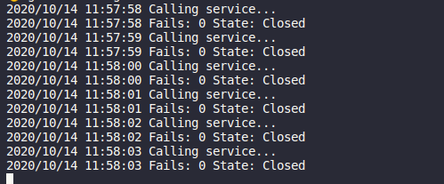

Recently I read about the circuit breaker pattern and I believe it is an interesting pattern with many use cases in today's microservices-centric universe :)

What is the circuit breaker pattern? Named after the electric switch that protects circuits from being damaged (due to excess current or overload for example), circuit breaker monitors a function call failures (in a microservice-oriented architecture, it can monitor a call to another service). Once the failures reach a certain threshold, the circuit breaker trips, and all subsequent calls to the circuit breaker return with an error or perhaps a fallback response.

If you want to find out more, there is <a href="https://martinfowler.com/bliki/CircuitBreaker.html" target="_blank" rel="noopener nofollow">an excellent article</a> by Martin Fowler on the topic. Also, I found <a href="https://docs.microsoft.com/en-us/azure/architecture/patterns/circuit-breaker" target="_blank" rel="noopener nofollow">this article from Microsoft Azure documentation</a> really insightful.

In order to understand the benefits of using the circuit breaker pattern, I will give you a simple, but real-world example. Let's assume that your service needs to get currency exchange rates from an external API few seconds. Assume this API has a downtime of 15 minutes at some point. Your service will make calls to this API and wait for a response and will time out, degrading your service's response time and performance in general.

Here comes the circuit breaker to the rescue! By protecting the calls to the external API using a circuit breaker, you can stop calling the external API after e.g. 5 consecutive attempts and respond with an error (or with a fallback response - e.g. the latest available version of the currency exchange rates when the call succeeded) for a period of time. Usually, you reset the failed attempts after some time (e.g. 5 minutes in our example) to start retrying.

Let's see a circuit breaker implementation in go below and we explain how it works:

```go showLineNumbers
package main

import (
	"errors"
	"log"
	"net/http"
	"time"
)

type state string

const (
	open     state = "Open"
	closed         = "Closed"
	halfOpen       = "Half Open"
)

type CircuitBreaker struct {
	failsThreshold int
	timeout        time.Duration
	fails          int
	state          state
}

func New(threshold int, timeout time.Duration) *CircuitBreaker {
	return &CircuitBreaker{failsThreshold: threshold, timeout: timeout, fails: 0, state: closed}
}

func (cb *CircuitBreaker) open() {
	cb.state = open
	go func() {
		time.Sleep(cb.timeout)
		cb.state = halfOpen

		log.Println("Fails:", cb.fails, "State:", cb.state)
	}()
}

func (cb *CircuitBreaker) Perform(action func() error) (err error) {
	switch cb.state {
	case closed:
		err = action()
		if err != nil {
			cb.fails++
		}
		if cb.fails >= cb.failsThreshold {
			cb.open()
		}
	case open:
		err = errors.New("Failed response without calling service")
	case halfOpen:
		err := action()
		if err != nil {
			cb.open()
		} else {
			cb.state = closed
			cb.fails = 0
		}
	}

	log.Println("Fails:", cb.fails, "State:", cb.state)
	return
}

func main() {
	cb := New(3, 5*time.Second)

	for {
		time.Sleep(1 * time.Second)
		cb.Perform(callService)
	}
}

func callService() error {
	log.Println("Calling service...")
	_, err := http.Get("http://localhost:8000")

	return err
}
```

First of all, in **lines 10-16** we define the states of the circuit breaker. When the circuit breaker is closed, everything works great and we get the response from the external service we want to call. When the circuit breaker is open, the external service is down and we return an error. When the circuit breaker is half open, the failed attempts to the service have just been reset to zero. If the next attempt is a failure, the circuit breaker goes back to an open state for some more time (the time out period we described above).

Then, we define the `CircuitBreaker` struct. Its main attributes is the failures threshold (after how many failed API calls should the circuit breaker trip) and the timeout period (for how long should the circuit breaker be in an open state).

The main method of `CircuitBreaker` is `Perform` in **lines 39-63**. This method accepts the actual service call function. Based on the state of the `CircuitBreaker`:

- when the state is closed (the default when we create the circuit breaker), we call the service call function and if there was an error, we increment the counter of failed attempts. If the failed attempts have reached the failures threshold, we switch the state of the circuit breaker to open and run a goroutine to switch the state to half open after the time out period
- when the state is open, we just return an error
- when the state is half open, we run the service call and, if it fails, we switch the circuit breaker to the open state, otherwise we reset it to the closed state and we reset the failed attempts counter

**Note**: The implementation in the example is not thread safe

That's pretty much it! The main function then calls (in an inifinite loop) the service every 1 second and uses the circuit breaker. In the example, the service call is a call to http://localhost:8000. You can test out this example code by starting a server with `python3 -m http.server` or `python -m SimpleHTTPServer` (for python 2), which creates a server listening on port 8000.

In order to test the behaviour of the circuit breaker, you can stop and start the python server at times and see the logs.

Here is an example with the service down:


As seen in the logs, the service calls fails the first 3 times and the circuit breaker trips. Then, for another 5 seconds (that the state of the circuit breaker is open), the service is not called at all, as the circuit breaker returns an error without trying the service call. After that, the circuit breaker switches to half open state and tries to make a call one more time. Since it fails, the circuit breaker returns to an open state for another 5 seconds.

And an example with the service up:



When the service is up, the external service is called every time and we get its response (I have created an index.html with a content of "test response", this is why the received data log displays that).

That's all for now!
